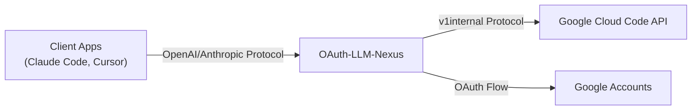

# OAuth-LLM-Nexus

[](https://github.com/pysugar/oauth-llm-nexus/releases)
[](https://go.dev)
[](LICENSE)

**OAuth-LLM-Nexus** is a powerful, lightweight proxy server that bridges standard LLM clients (OpenAI, Anthropic, Google GenAI) with Google's internal "Cloud Code" API (Gemini). It allows you to use your Google account's free tier quotas to power your favorite AI tools like Claude Code, Cursor, generic OpenAI clients, and more.

## ✨ Features

-   **Multi-Protocol Support**:
    -   **OpenAI Compatible**: `/v1/chat/completions` (Works with Cursor, Open WebUI, etc.)
    -   **Anthropic Compatible**: `/anthropic/v1/messages` (Works with Claude Code, Aider, etc.)
    -   **Google GenAI Compatible**: `/genai/v1beta/models` (Works with official Google SDKs)
-   **Smart Model Mapping**: Configurable routing from client model names to backend models via Dashboard.
-   **Account Pool Management**: Link multiple Google accounts to pool quotas and increase limits.
-   **Automatic Failover**: Automatically switches to the next available account if one hits a rate limit (429).
-   **Dashboard**: A built-in web dashboard to manage accounts, model routes, view usage, and get your API key.
-   **Secure**: API Key authentication for client access.
-   **Homebrew Support**: Easy installation via `brew tap` with service management.

## 🚀 Installation

### Option 1: Homebrew (macOS/Linux)

```bash
# Add tap
brew tap pysugar/tap

# Install
brew install oauth-llm-nexus

# Start as service
brew services start oauth-llm-nexus
```

### Option 2: Download Binary

Download the latest release for your platform from [Releases](https://github.com/pysugar/oauth-llm-nexus/releases).

```bash
# macOS Apple Silicon
curl -LO https://github.com/pysugar/oauth-llm-nexus/releases/latest/download/nexus-darwin-arm64
chmod +x nexus-darwin-arm64
./nexus-darwin-arm64
```

### Option 3: Build from Source

```bash
git clone https://github.com/pysugar/oauth-llm-nexus.git
cd oauth-llm-nexus
go build -o nexus ./cmd/nexus
./nexus
```

## ⚙️ Quick Start

Just run the binary - no configuration needed for most users:

```bash
./nexus
```

The server will start on `127.0.0.1:8080` by default. Visit `http://localhost:8080` to access the dashboard.

### Environment Variables

| Variable | Default | Description |
|:---------|:--------|:------------|
| `PORT` | `8080` | Server port |
| `HOST` | `127.0.0.1` | Bind address. Set to `0.0.0.0` for LAN access |

**Example: LAN Access**
```bash
export HOST=0.0.0.0
export PORT=8086
./nexus
# Now accessible from other devices on your network
```

### 💡 Deployment Tip: Headless/Cloud Server

Since OAuth-LLM-Nexus requires a browser for the initial Google login (which can be tricky on a headless Linux server), you can:

1.  Run `nexus` on your local PC/Mac first.
2.  Log in via the Dashboard (`http://localhost:8080`) to generate `nexus.db` with your tokens.
3.  Copy the `nexus.db` file to your Linux server.
4.  Run `nexus` on the server - it will pick up the existing valid session!

```bash
# Local
scp nexus.db user@your-server:/path/to/nexus/

# Server
export HOST=0.0.0.0
./nexus
```

## 📖 Usage

### 1. Open the Dashboard

Visit `http://localhost:8086` in your browser.

### 2. Link Account

Click "Add Account" and sign in with your Google account (must have access to Gemini/Cloud Code).

### 3. Get API Key

Copy your API Key from the dashboard (`sk-xxxxxxxx...`).

### 4. Configure Clients

**OpenAI SDK / Compatible Apps (Cursor, Continue, etc.)**:
```
Base URL: http://localhost:8086/v1
API Key: sk-xxxxxxxx...
Model: gpt-4o, gpt-4, or gemini-2.5-pro
```

**Anthropic / Claude Code**:
```bash
export ANTHROPIC_BASE_URL=http://localhost:8086/anthropic
export ANTHROPIC_API_KEY=sk-xxxxxxxx...
# Model: claude-sonnet-4-5, claude-3-5-sonnet, etc.
```

**Google GenAI SDK (v0.2+)**:
```python
from google import genai

client = genai.Client(
    api_key="sk-xxx",
    http_options={"base_url": "http://localhost:8086/genai"}
)

response = client.models.generate_content(
    model="gemini-3-flash", 
    contents="Hello world"
)
print(response.text)
```

## 🗺️ Model Mapping

OAuth-LLM-Nexus supports configurable model routing. Configure mappings via the Dashboard or edit `config/model_routes.yaml`:

```yaml
routes:
  - client: gpt-4o
    provider: google
    target: gemini-3-pro-high
  - client: claude-sonnet-4-5
    provider: google
    target: claude-sonnet-4-5
```

Models not in the routing table are passed through as-is (e.g., native Gemini models).

## 🏗️ Architecture



## 🍺 Homebrew Service

If installed via Homebrew:

```bash
# Start service (runs on boot)
brew services start oauth-llm-nexus

# Stop service
brew services stop oauth-llm-nexus

# View logs
tail -f /opt/homebrew/var/log/oauth-llm-nexus.log
```

**Note**: You need to configure OAuth credentials in the service environment. Edit the plist file or set environment variables in your shell profile.

## 📝 API Endpoints

| Endpoint | Protocol | Description |
|:---------|:---------|:------------|
| `GET /` | - | Dashboard UI |
| `POST /v1/chat/completions` | OpenAI | Chat completions |
| `GET /v1/models` | OpenAI | List models |
| `POST /anthropic/v1/messages` | Anthropic | Messages API |
| `POST /genai/v1beta/models/{model}:generateContent` | GenAI | Generate content |
| `GET /api/accounts` | Internal | List linked accounts |
| `GET /api/model-routes` | Internal | List model routes |

## 🤝 Contributing

Pull requests are welcome. For major changes, please open an issue first to discuss what you would like to change.

## 📄 License

[MIT](LICENSE)
