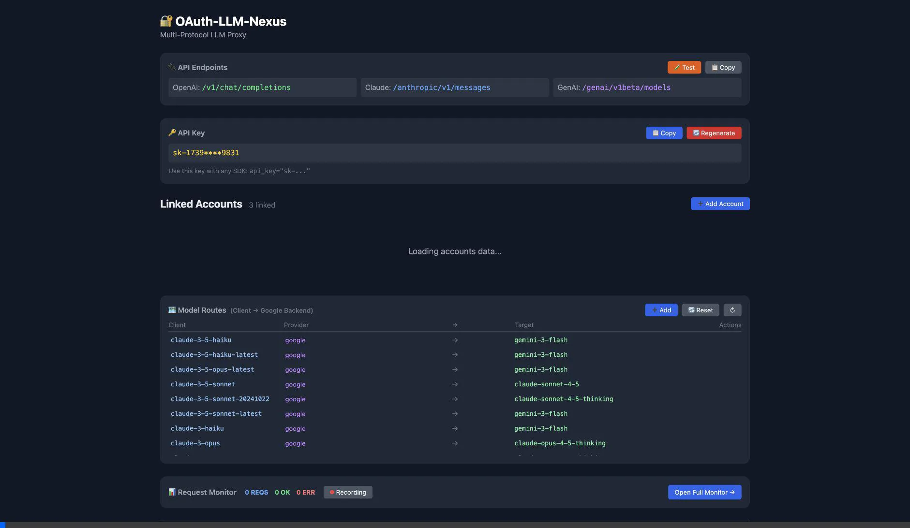
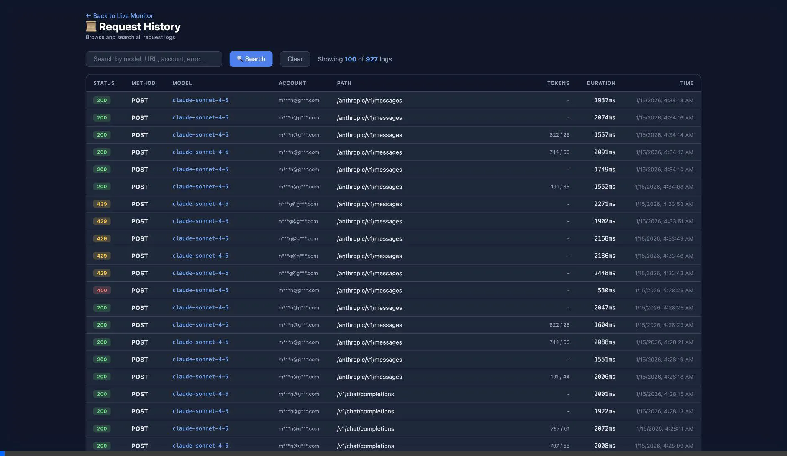
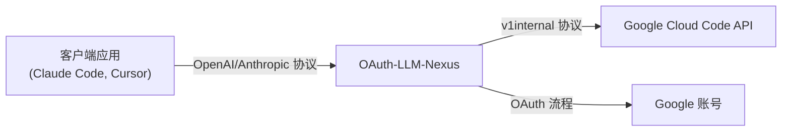

# OAuth-LLM-Nexus

[](https://github.com/pysugar/oauth-llm-nexus/releases)
[](https://go.dev)
[](LICENSE)

**OAuth-LLM-Nexus** 是一个强大的轻量级代理服务器，它能够将标准 LLM 客户端（OpenAI、Anthropic、Google GenAI）与 Google 内部的 "Cloud Code" API (Gemini) 连接起来。让你使用 Google 账号的免费配额来驱动你喜欢的 AI 工具，如 Claude Code、Cursor、通用 OpenAI 客户端等。

## ✨ 特性

-   **多协议支持**：
    -   **OpenAI 兼容**：`/v1/chat/completions`（支持 Cursor、Open WebUI 等）
    -   **Anthropic 兼容**：`/anthropic/v1/messages`（支持 Claude Code、Aider 等）
    -   **Google GenAI 兼容**：`/genai/v1beta/models`（支持官方 Google SDK）
-   **智能模型映射**：通过 Dashboard 配置客户端模型名到后端模型的路由。
-   **账号池管理**：链接多个 Google 账号以池化配额，提升限制。
-   **用户级配额路由**：使用 `X-Nexus-Account` 请求头将请求路由到指定账号，实现配额隔离。
-   **自动故障转移**：当一个账号触发速率限制 (429) 时，自动切换到下一个可用账号。
-   **仪表盘**：内置 Web 仪表盘，管理账号、模型路由、查看使用情况和获取 API Key。
-   **请求监控**：实时请求监控，包含详细日志、延迟追踪和错误分析。
-   **安全性**：API Key 认证保护客户端访问。
-   **Homebrew 支持**：通过 `brew tap` 轻松安装，支持服务管理。

📚 **快速入门**：[Claude Code 配置指南](docs/CLAUDE_CODE_SETUP.md) | [English](README.md) | [中文](README_CN.md)

## 🖼️ 界面预览

### 仪表盘总览
**账号管理、API Key（默认脱敏）、模型路由**


### 请求监控
**实时请求历史与隐私脱敏**


> **🔒 隐私保护**：所有敏感信息（邮箱和 API Key）**默认脱敏显示**。鼠标悬停可查看完整内容。

## 🚀 安装

### 方式一：Homebrew (macOS/Linux)

```bash
# 添加 tap
brew tap pysugar/tap

# 安装
brew install oauth-llm-nexus

# 启动服务
brew services start oauth-llm-nexus
```

### 方式二：下载预编译二进制

从 [Releases](https://github.com/pysugar/oauth-llm-nexus/releases) 下载适合你平台的最新版本。

```bash
# macOS Apple Silicon
curl -LO https://github.com/pysugar/oauth-llm-nexus/releases/latest/download/nexus-darwin-arm64
chmod +x nexus-darwin-arm64
./nexus-darwin-arm64
```

### 方式三：从源码构建

```bash
git clone https://github.com/pysugar/oauth-llm-nexus.git
cd oauth-llm-nexus

# 使用 Make 构建 (自动注入版本号)
make build

# 或者手动构建
# go build -ldflags "-X github.com/pysugar/oauth-llm-nexus/internal/version.Version=dev" -o nexus ./cmd/nexus

./nexus
```

### 方式四：Docker

```bash
# 从 GitHub Container Registry 拉取
docker pull ghcr.io/pysugar/oauth-llm-nexus:latest

# 运行（先创建目录以确保权限正确）
mkdir -p ~/.oauth-llm-nexus
docker run -d \
  --name oauth-llm-nexus \
  -p 8086:8080 \
  -v ~/.oauth-llm-nexus:/home/nexus \
  ghcr.io/pysugar/oauth-llm-nexus:latest

# 或使用 Docker Compose
curl -O https://raw.githubusercontent.com/pysugar/oauth-llm-nexus/main/docker-compose.yml
docker-compose up -d
```

## ⚙️ 快速开始

直接运行二进制文件即可，大多数用户无需任何配置：

```bash
./nexus
```

服务器默认在 `127.0.0.1:8080` 启动。访问 `http://localhost:8080` 打开仪表盘。

### 环境变量

| 变量 | 默认值 | 说明 |
|:---------|:--------|:------------|
| `PORT` | `8080` (开发) / `8086` (发布) | 服务端口 |
| `HOST` | `127.0.0.1` | 绑定地址。设置为 `0.0.0.0` 可供局域网访问 |
| `NEXUS_MODE` | - | 设置为 `release` 启用生产模式（默认端口改为 8086） |
| `NEXUS_ADMIN_PASSWORD` | - | 可选密码，用于保护 Dashboard 和 API 端点 |
| `NEXUS_VERBOSE` | - | 设置为 `1` 或 `true` 启用详细的请求/响应日志 |

**示例：带密码保护的局域网共享**
```bash
export HOST=0.0.0.0
export PORT=8086
export NEXUS_ADMIN_PASSWORD=mysecret
./nexus
# 现在可以从局域网其他设备访问，需要密码验证
```

**示例：启用详细日志进行调试**
```bash
NEXUS_VERBOSE=1 ./nexus
# 日志将包含完整的请求体和 API 响应内容
```

### 🔐 仪表盘安全

当设置了 `NEXUS_ADMIN_PASSWORD` 时，Dashboard 和 `/api/*` 端点会启用 HTTP Basic 认证：

- **用户名**：任意值（如 `admin`、你的邮箱，或留空）
- **密码**：`NEXUS_ADMIN_PASSWORD` 的值

如果未设置，Dashboard 可以无需认证直接访问（本地开发默认行为）。

### 💡 无头服务器/Docker 部署

> **⚠️ OAuth 限制**：Google 的 Antigravity OAuth 客户端只允许 `localhost` 回调。这意味着 OAuth 登录必须在运行 nexus 的机器上完成。这是 Antigravity OAuth 客户端的安全特性，而非 Bug。

**远程服务器或 Docker 容器部署步骤：**

1. **先在本地完成 OAuth**：
   ```bash
   # 在有浏览器的本地机器上
   ./nexus
   # 访问 http://localhost:8086，完成 OAuth 登录
   ```

2. **将数据库复制到服务器**：
   ```bash
   # 数据库包含你的认证会话
   scp nexus.db user@your-server:/path/to/nexus/
   
   # Docker 部署：先创建目录并设置正确权限
   mkdir -p ~/.oauth-llm-nexus
   cp nexus.db ~/.oauth-llm-nexus/
   # 如果目录被 root 创建，修复权限：
   # sudo chown -R $(id -u):$(id -g) ~/.oauth-llm-nexus/
   ```

3. **在服务器上启动 nexus**：
   ```bash
   # 原生方式
   HOST=0.0.0.0 NEXUS_ADMIN_PASSWORD=yourpassword ./nexus
   
   # Docker（数据库已在 ~/.oauth-llm-nexus/）
   docker-compose up -d
   ```

你的认证会话会被自动读取。Token 刷新在后台自动进行。

## 📖 使用方法

### 1. 打开仪表盘

在浏览器中访问 `http://localhost:8086`。

### 2. 链接账号

点击 "Add Account" 并使用你的 Google 账号登录（必须有 Gemini/Cloud Code 访问权限）。

### 3. 获取 API Key

从仪表盘复制你的 API Key (`sk-xxxxxxxx...`)。

### 4. 配置客户端

**OpenAI SDK / 兼容应用（Cursor、Continue 等）**：
```
Base URL: http://localhost:8086/v1
API Key: sk-xxxxxxxx...
Model: gpt-4o, gpt-4, 或 gemini-2.5-pro
```

**Anthropic / Claude Code**：
```bash
export ANTHROPIC_BASE_URL=http://localhost:8086/anthropic
export ANTHROPIC_API_KEY=sk-xxxxxxxx...
# Model: claude-sonnet-4-5, claude-3-5-sonnet, 等
```

**Google GenAI SDK (v0.2+)**:
```python
from google import genai

client = genai.Client(
    api_key="sk-xxx",
    http_options={"base_url": "http://localhost:8086/genai"}
)

response = client.models.generate_content(
    model="gemini-3-flash", 
    contents="你好，世界"
)
print(response.text)
```

## 🗺️ 模型映射

OAuth-LLM-Nexus 支持可配置的模型路由。通过 Dashboard 配置映射或编辑 `config/model_routes.yaml`：

```yaml
routes:
  - client: gpt-4o
    provider: google
    target: gemini-3-pro-high
  - client: claude-sonnet-4-5
    provider: google
    target: claude-sonnet-4-5
```

不在路由表中的模型会直接透传（如原生 Gemini 模型）。

## 🎯 用户级配额路由

默认情况下，所有请求使用 **Primary（主账号）** 的配额。你可以使用 `X-Nexus-Account` 请求头将特定请求路由到不同账号：

```bash
# 通过邮箱指定账号
curl -X POST http://localhost:8086/v1/chat/completions \
  -H "Authorization: Bearer sk-xxx" \
  -H "X-Nexus-Account: user@example.com" \
  -H "Content-Type: application/json" \
  -d '{"model": "gpt-4o", "messages": [{"role": "user", "content": "你好"}]}'
```

**使用场景**：
- **团队配额隔离**：为不同团队成员分配不同账号
- **项目级路由**：为不同项目使用独立账号  
- **速率限制管理**：跨多个账号分散高并发工作负载

| 请求头 | 值 | 描述 |
|:-------|:------|:------------|
| `X-Nexus-Account` | 邮箱或账号 ID | 路由到指定账号而非主账号 |

> **注意**：指定的账号必须已在 Dashboard 中链接且处于活跃状态。如果找不到，请求将返回 401 Unauthorized。

## 🛠️ 工具

### 快速配额检查

检查**本地已登录 Antigravity 账号**的实时配额（非 Nexus 中链接的账号）：

```bash
# 安装依赖
pip install requests

# 运行配额检查
python3 scripts/antigravity_quota.py

# 输出格式
python3 scripts/antigravity_quota.py --json    # JSON 输出
python3 scripts/antigravity_quota.py --raw     # 原始 API 响应
```

此脚本从本地 Antigravity 安装读取凭证，显示所有可用模型的精确配额百分比。

## 🏗️ 架构



## 🍺 Homebrew 服务

如果通过 Homebrew 安装：

```bash
# 启动服务（开机自启）
brew services start oauth-llm-nexus

# 停止服务
brew services stop oauth-llm-nexus

# 查看日志
tail -f /opt/homebrew/var/log/oauth-llm-nexus.log
```

**自定义环境变量**：编辑 `$(brew --prefix)/etc/oauth-llm-nexus.env`：

```bash
# 创建/编辑环境文件
echo 'export NEXUS_VERBOSE="true"' >> $(brew --prefix)/etc/oauth-llm-nexus.env
echo 'export NEXUS_ADMIN_PASSWORD="yourpassword"' >> $(brew --prefix)/etc/oauth-llm-nexus.env

# 重启服务以应用
brew services restart oauth-llm-nexus
```

## 🌐 离线 / 受限环境

如果在隔离网络或防火墙受限环境中运行：

1. **模型路由**：下载 [`config/model_routes.yaml`](https://github.com/pysugar/oauth-llm-nexus/blob/main/config/model_routes.yaml) 并放置到以下位置之一：
   - `./config/model_routes.yaml`
   - `~/.config/nexus/model_routes.yaml`
   - `/etc/nexus/model_routes.yaml`

2. **仪表盘样式**：仪表盘使用 Tailwind CSS CDN。如果 CDN 被阻止，将显示基础样式的回退提示信息。

## 📝 API 端点

| 端点 | 协议 | 描述 |
|:---------|:---------|:------------|
| `GET /` | - | 仪表盘 UI |
| `POST /v1/chat/completions` | OpenAI | 聊天补全 |
| `GET /v1/models` | OpenAI | 列出模型 |
| `POST /anthropic/v1/messages` | Anthropic | Messages API |
| `GET /anthropic/v1/models` | Anthropic | 列出 Claude 模型 |
| `POST /genai/v1beta/models/{model}:generateContent` | GenAI | 生成内容 |
| `POST /genai/v1beta/models/{model}:streamGenerateContent` | GenAI | 流式生成内容 |
| `GET /genai/v1beta/models` | GenAI | 列出可用模型 |
| `GET /api/accounts` | 内部 | 列出已链接账号 |
| `GET /api/model-routes` | 内部 | 列出模型路由 |
| `GET /monitor` | 内部 | 请求监控面板 |

### 请求头

| 请求头 | 必需 | 描述 |
|:-------|:---------|:------------|
| `Authorization` | 是 | API key，格式 `Bearer sk-xxx` |
| `X-Nexus-Account` | 否 | 通过邮箱或 ID 路由到指定账号 |
| `X-Request-ID` | 否 | 自定义请求 ID 用于追踪 |

## 🤝 贡献

欢迎提交 Pull Request。对于重大更改，请先开 Issue 讨论你想要更改的内容。

## 📄 许可证

[Sustainable Use License](LICENSE) - 仅供教育和研究用途。详见 LICENSE 文件。
