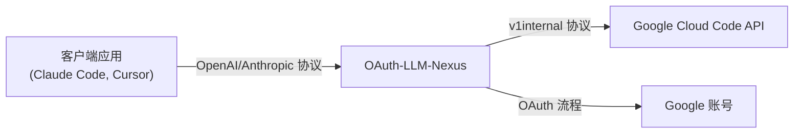

# OAuth-LLM-Nexus

[](https://github.com/pysugar/oauth-llm-nexus/releases)
[](https://go.dev)
[](LICENSE)

**OAuth-LLM-Nexus** 是一个强大的轻量级代理服务器，它能够将标准 LLM 客户端（OpenAI、Anthropic、Google GenAI）与 Google 内部的 "Cloud Code" API (Gemini) 连接起来。让你使用 Google 账号的免费配额来驱动你喜欢的 AI 工具，如 Claude Code、Cursor、通用 OpenAI 客户端等。

## ✨ 特性

-   **多协议支持**：
    -   **OpenAI 兼容**：`/v1/chat/completions`（支持 Cursor、Open WebUI 等）
    -   **Anthropic 兼容**：`/anthropic/v1/messages`（支持 Claude Code、Aider 等）
    -   **Google GenAI 兼容**：`/genai/v1beta/models`（支持官方 Google SDK）
-   **智能模型映射**：通过 Dashboard 配置客户端模型名到后端模型的路由。
-   **账号池管理**：链接多个 Google 账号以池化配额，提升限制。
-   **自动故障转移**：当一个账号触发速率限制 (429) 时，自动切换到下一个可用账号。
-   **仪表盘**：内置 Web 仪表盘，管理账号、模型路由、查看使用情况和获取 API Key。
-   **安全性**：API Key 认证保护客户端访问。
-   **Homebrew 支持**：通过 `brew tap` 轻松安装，支持服务管理。

## 🚀 安装

### 方式一：Homebrew (macOS/Linux)

```bash
# 添加 tap
brew tap pysugar/tap

# 安装
brew install oauth-llm-nexus

# 启动服务
brew services start oauth-llm-nexus
```

### 方式二：下载预编译二进制

从 [Releases](https://github.com/pysugar/oauth-llm-nexus/releases) 下载适合你平台的最新版本。

```bash
# macOS Apple Silicon
curl -LO https://github.com/pysugar/oauth-llm-nexus/releases/latest/download/nexus-darwin-arm64
chmod +x nexus-darwin-arm64
./nexus-darwin-arm64
```

### 方式三：从源码构建

```bash
git clone https://github.com/pysugar/oauth-llm-nexus.git
cd oauth-llm-nexus
go build -o nexus ./cmd/nexus
./nexus
```

## ⚙️ 快速开始

直接运行二进制文件即可，大多数用户无需任何配置：

```bash
./nexus
```

服务器默认在 `127.0.0.1:8080` 启动。访问 `http://localhost:8080` 打开仪表盘。

### 环境变量

| 变量 | 默认值 | 说明 |
|:---------|:--------|:------------|
| `PORT` | `8080` (开发) / `8086` (发布) | 服务端口 |
| `HOST` | `127.0.0.1` | 绑定地址。设置为 `0.0.0.0` 可供局域网访问 |
| `NEXUS_MODE` | - | 设置为 `release` 启用生产模式（默认端口改为 8086） |
| `NEXUS_ADMIN_PASSWORD` | - | 可选密码，用于保护 Dashboard 和 API 端点 |

**示例：带密码保护的局域网共享**
```bash
export HOST=0.0.0.0
export PORT=8086
export NEXUS_ADMIN_PASSWORD=mysecret
./nexus
# 现在可以从局域网其他设备访问，需要密码验证
```

### 🔐 仪表盘安全

当设置了 `NEXUS_ADMIN_PASSWORD` 时，Dashboard 和 `/api/*` 端点会启用 HTTP Basic 认证：

- **用户名**：任意值（如 `admin`、你的邮箱，或留空）
- **密码**：`NEXUS_ADMIN_PASSWORD` 的值

如果未设置，Dashboard 可以无需认证直接访问（本地开发默认行为）。

### 💡 部署小技巧：无头/云服务器部署

由于 OAuth-LLM-Nexus 首次登录需要浏览器进行 Google 认证（在无头 Linux 服务器上操作较麻烦），你可以：

1.  先在本地 PC/Mac 上运行 `nexus`。
2.  访问 Dashboard (`http://localhost:8080`) 完成登录，这会生成包含 Token 的 `nexus.db`。
3.  将 `nexus.db` 文件复制到你的 Linux 服务器。
4.  在服务器上启动 `nexus` —— 它会自动读取已有的有效会话！

```bash
# 本地传输
scp nexus.db user@your-server:/path/to/nexus/

# 服务器端
export HOST=0.0.0.0
export NEXUS_ADMIN_PASSWORD=yourpassword
./nexus
```

## 📖 使用方法

### 1. 打开仪表盘

在浏览器中访问 `http://localhost:8086`。

### 2. 链接账号

点击 "Add Account" 并使用你的 Google 账号登录（必须有 Gemini/Cloud Code 访问权限）。

### 3. 获取 API Key

从仪表盘复制你的 API Key (`sk-xxxxxxxx...`)。

### 4. 配置客户端

**OpenAI SDK / 兼容应用（Cursor、Continue 等）**：
```
Base URL: http://localhost:8086/v1
API Key: sk-xxxxxxxx...
Model: gpt-4o, gpt-4, 或 gemini-2.5-pro
```

**Anthropic / Claude Code**：
```bash
export ANTHROPIC_BASE_URL=http://localhost:8086/anthropic
export ANTHROPIC_API_KEY=sk-xxxxxxxx...
# Model: claude-sonnet-4-5, claude-3-5-sonnet, 等
```

**Google GenAI SDK (v0.2+)**:
```python
from google import genai

client = genai.Client(
    api_key="sk-xxx",
    http_options={"base_url": "http://localhost:8086/genai"}
)

response = client.models.generate_content(
    model="gemini-3-flash", 
    contents="你好，世界"
)
print(response.text)
```

## 🗺️ 模型映射

OAuth-LLM-Nexus 支持可配置的模型路由。通过 Dashboard 配置映射或编辑 `config/model_routes.yaml`：

```yaml
routes:
  - client: gpt-4o
    provider: google
    target: gemini-3-pro-high
  - client: claude-sonnet-4-5
    provider: google
    target: claude-sonnet-4-5
```

不在路由表中的模型会直接透传（如原生 Gemini 模型）。

## 🏗️ 架构



## 🍺 Homebrew 服务

如果通过 Homebrew 安装：

```bash
# 启动服务（开机自启）
brew services start oauth-llm-nexus

# 停止服务
brew services stop oauth-llm-nexus

# 查看日志
tail -f /opt/homebrew/var/log/oauth-llm-nexus.log
```

**注意**：你需要在服务环境中配置 OAuth 凭据。编辑 plist 文件或在 shell profile 中设置环境变量。

## 🌐 离线 / 受限环境

如果在隔离网络或防火墙受限环境中运行：

1. **模型路由**：下载 [`config/model_routes.yaml`](https://github.com/pysugar/oauth-llm-nexus/blob/main/config/model_routes.yaml) 并放置到以下位置之一：
   - `./config/model_routes.yaml`
   - `~/.config/nexus/model_routes.yaml`
   - `/etc/nexus/model_routes.yaml`

2. **仪表盘样式**：仪表盘使用 Tailwind CSS CDN。如果 CDN 被阻止，将显示基础样式的回退提示信息。

## 📝 API 端点

| 端点 | 协议 | 描述 |
|:---------|:---------|:------------|
| `GET /` | - | 仪表盘 UI |
| `POST /v1/chat/completions` | OpenAI | 聊天补全 |
| `GET /v1/models` | OpenAI | 列出模型 |
| `POST /anthropic/v1/messages` | Anthropic | Messages API |
| `POST /genai/v1beta/models/{model}:generateContent` | GenAI | 生成内容 |
| `GET /api/accounts` | 内部 | 列出已链接账号 |
| `GET /api/model-routes` | 内部 | 列出模型路由 |

## 🤝 贡献

欢迎提交 Pull Request。对于重大更改，请先开 Issue 讨论你想要更改的内容。

## 📄 许可证

[MIT](LICENSE)
