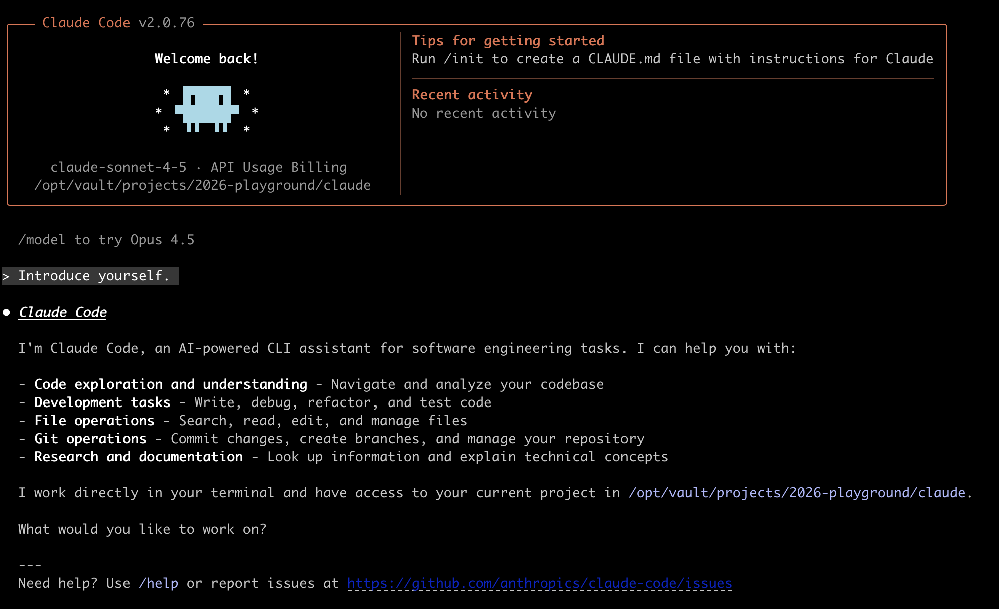
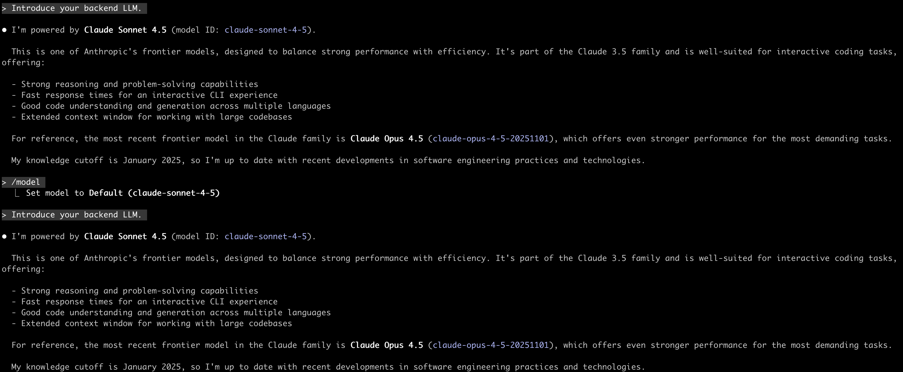
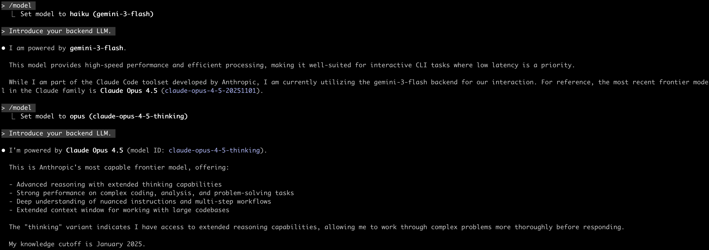

# Claude Code + OAuth-LLM-Nexus 完美配置指南

使用 OAuth-LLM-Nexus 代理让 Claude Code 通过 Google Account 免费额度访问 Gemini 模型。

## 🚀 快速开始

### 1. 启动 Nexus 代理

```bash
# 使用 Homebrew
brew services start oauth-llm-nexus

# 或手动运行
./nexus
```

访问 Dashboard `http://localhost:8086` 获取 API Key。

### 2. 配置 Claude Code

在 `~/.claude/settings.json` 中添加以下配置：

```json
{
  "env": {
    "ANTHROPIC_AUTH_TOKEN": "sk-your-api-key-here",
    "ANTHROPIC_BASE_URL": "http://127.0.0.1:8086/anthropic",
    "ANTHROPIC_MODEL": "claude-sonnet-4-5",
    "ANTHROPIC_DEFAULT_HAIKU_MODEL": "gemini-3-flash",
    "ANTHROPIC_DEFAULT_SONNET_MODEL": "claude-sonnet-4-5",
    "ANTHROPIC_DEFAULT_OPUS_MODEL": "claude-opus-4-5-thinking"
  },
  "model": "sonnet"
}
```

### 3. 验证效果

配置完成后，Claude Code 会通过 Nexus 代理访问 Google Cloud Code API：







## 📋 配置说明

| 环境变量 | 说明 |
|:---------|:-----|
| `ANTHROPIC_AUTH_TOKEN` | 从 Nexus Dashboard 获取的 API Key |
| `ANTHROPIC_BASE_URL` | Nexus 代理地址（默认 8086 端口） |
| `ANTHROPIC_MODEL` | 默认使用的模型 |
| `ANTHROPIC_DEFAULT_HAIKU_MODEL` | Claude 请求 haiku 时路由到的模型 |
| `ANTHROPIC_DEFAULT_SONNET_MODEL` | Claude 请求 sonnet 时路由到的模型 |
| `ANTHROPIC_DEFAULT_OPUS_MODEL` | Claude 请求 opus 时路由到的模型 |

## 🗺️ 模型路由

Nexus 会将 Claude 请求的模型名称路由到 Google Cloud Code 支持的模型：

| Claude 请求 | 路由到 |
|:-----------|:-------|
| `claude-sonnet-4-5` | `claude-sonnet-4-5`（原生支持） |
| `claude-opus-4-5-thinking` | `claude-opus-4-5-thinking`（原生支持） |
| `gemini-3-flash` | `gemini-3-flash` |

你可以在 Dashboard 的 **Model Routes** 中自定义路由规则。

## ⚠️ 常见问题

### Permission Denied 错误

如果遇到 `Permission denied on resource project xxx` 错误，说明账号使用了错误的 Project ID。

**问题原因**：
- 通过 Account Discovery 导入的凭据可能带有用户自己的 GCP 项目 ID
- 需要使用 Google Cloud Code 的默认项目 `bamboo-precept-lgxtn`

**解决方法**：
1. 在 Dashboard 中删除问题账号
2. 点击 **"Link Google Account"** 通过 OAuth 重新链接
3. 系统会自动从 Google API 获取正确的 Project ID

> 💡 **推荐**：优先使用 OAuth 链接账号，而不是导入本地凭据文件。

### 模型不可用

确保你使用的模型在 Google Cloud Code API 中可用。查看 Dashboard 中账号的 "Available Models" 列表。
